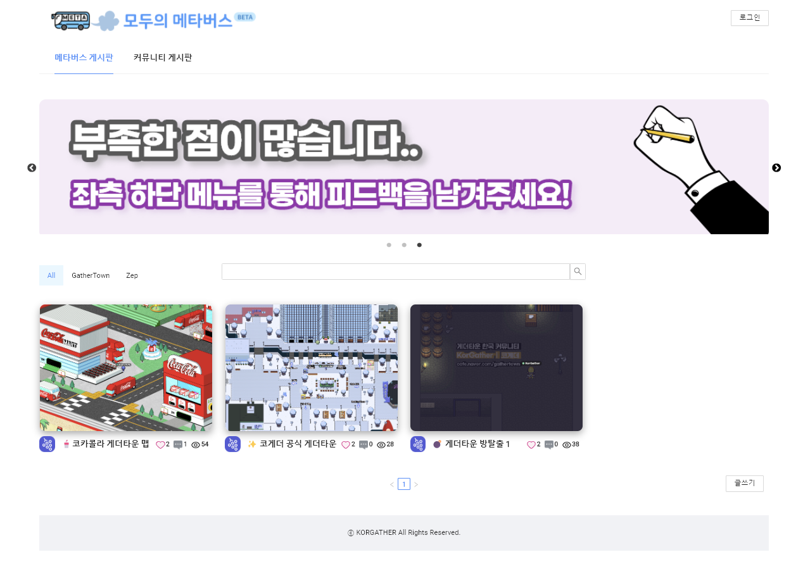
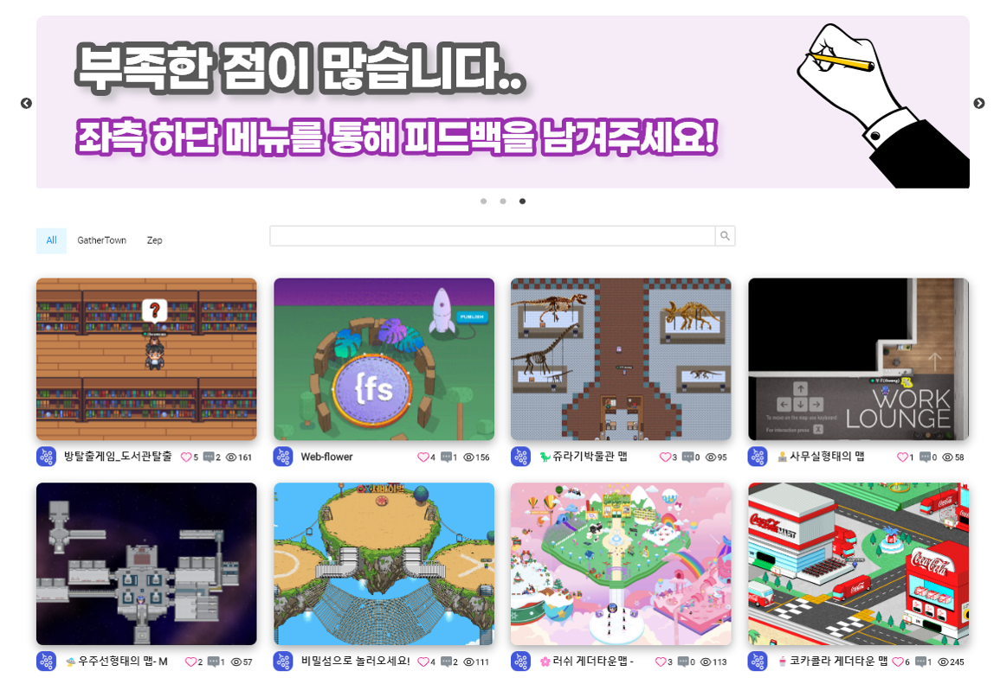
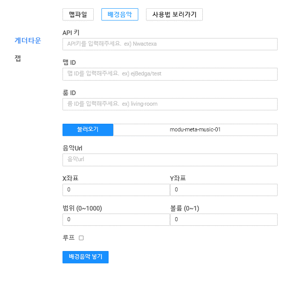
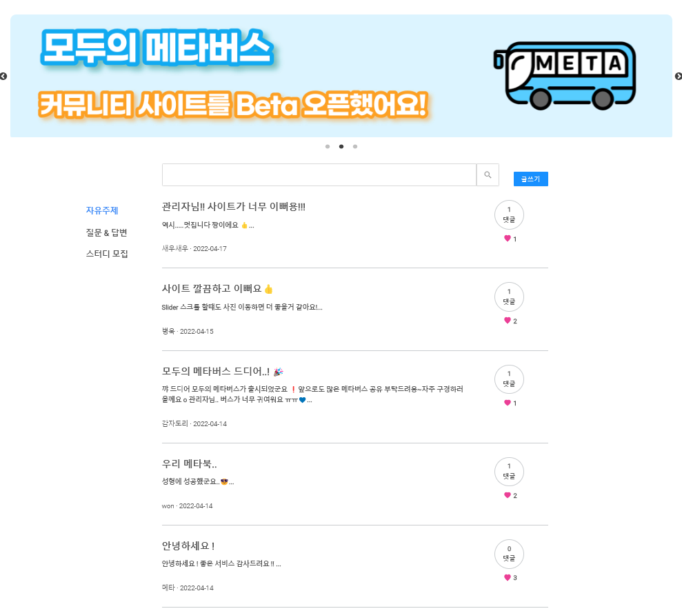

 

# 메타버스 공유 커뮤니티 - 모두의메타버스(ModuMeta)

 
 

### 🔗 링크 : https://www.modumeta.com/

 

 
 
   
# 📌소개

 

 

'모두의 메타버스'는 게더타운, 젭 등 웹 기반 메타버스 플랫폼 이용자들이 자신이 만든 메타버스 공간의 URL을 게시글을 통해 공유하고, 댓글, 좋아요 등을 통해 상호작용 할 수 있는 SNS 형태의 커뮤니티 사이트입니다.

 

 

각 플랫폼에서 제공하는 API(배경음악 삽입 API 등)를 이용자들이 사용하기 편하게 폼 작성 형태로 가공해 제공하는 등 메타버스 제작자를 위한 편의 기능도 제공하고 있습니다.

 

 

네이버카페 게더타운 커뮤니티 코게더(KorGather)를 운영하면서 게더타운 뿐만 아니라 다른 메타버스 플랫폼(젭, 세컨블록 등)을 한 곳에서 경험 할 수 있고, 서로 다른 메타버스 플랫폼 이용자들이 상호작용 할 수 있는 커뮤니티 사이트를 만들고 싶어서 제작하게 되었습니다.

 
 

EarlGray (https://github.com/scm1400)  
Gwang (https://github.com/eungwang1)

### Backend : SpirngBoot

### Frontend : Next.js

### Infra : AWS EB, RDS, S3, Vercel
